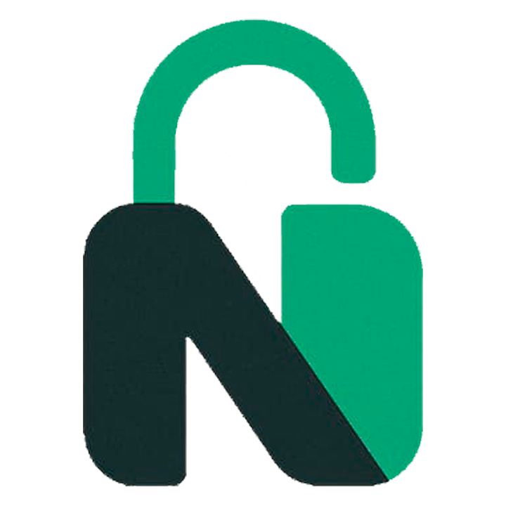

# 🥗 NutriNow 2.0 — O Futuro da Nutrição com I.A



## 🎯 Nossa Proposta: Saúde Inteligente e Privada

O **NutriNow 2.0** não é apenas mais um rastreador de calorias ou gerenciador de dietas. Nossa proposta é ser um **Consultor de Saúde Onipresente**, eliminando a barreira entre o usuário e o conhecimento nutricional de alta qualidade, sem comprometer seus dados pessoais.

Muitas plataformas de saúde hoje dependem de serviços na nuvem onde seus dados alimentares, médicos e rotinas são vendidos ou processados por grandes modelos de linguagem externos. O NutriNow rompe com isso através da **I.A**.

---

## 🍎 Saúde e Nutrição na Era Digital

A nutrição é o pilar fundamental da longevidade e da performance humana. No entanto, o acesso a orientações personalizadas muitas vezes é caro ou inacessível. O **NutriNow** surge para democratizar esse acesso, utilizando a tecnologia para transformar dados complexos em escolhas simples e saudáveis.

### O Papel da I.A na Nutrição Moderna

A Inteligência Artificial atua como um catalisador para a mudança de hábitos. Diferente de tabelas estáticas, a I.A do NutriNow:

- **Personaliza em Escala**: Adapta recomendações em tempo real com base no seu metabolismo e objetivos únicos.
- **Simplifica o Complexo**: Transforma uma simples foto de um prato em uma análise técnica completa de macronutrientes.
- **Educação Continuada**: Não apenas diz o que comer, mas explica o _porquê_, ajudando na construção de uma consciência alimentar duradoura.
- **Suporte 24/7**: Erros e dúvidas não têm hora para acontecer. Ter uma assistência inteligente sempre disponível reduz drasticamente as chances de desistência de uma dieta ou plano de treino.

---

## 🤖 A Inteligência Artificial

A IA do NutriNow é baseada na arquitetura **NEURA**, um motor de inteligência artificial projetado para extrair o máximo de modelos compactos de última geração (LLMs) diretamente no hardware do usuário.

### Por que IA Local?

1.  **Privacidade Absoluta**: Seus dados de saúde são sensíveis. No NutriNow, suas fotos de pratos e conversas sobre saúde nunca deixam o seu disco rígido.
2.  **Custo Zero de API**: Ao usar seu próprio hardware (via Ollama), eliminamos mensalidades caras de APIs externas, permitindo uma ferramenta gratuita e poderosa.
3.  **Análise de Visão em Dois Estágios**:
    - **Identificação**: Nossa IA analisa a imagem de forma bruta para encontrar "fatos visuais" (ingredientes e porções).
    - **Interpretação**: Um modelo especialista em nutrição traduz esses fatos em macronutrientes e sugestões estratégicas.

---

## ✨ Funcionalidades Principais

### 💬 Chatbot NutriAI

Sua nutricionista particular disponível 24/7.

- **Contexto de Perfil**: Ela sabe sua meta (Ex: Emagrecer) e ajusta o tom da conversa para te manter motivado.
- **Memória Persistente**: Graças à integração com o banco de dados, ela lembra do seu progresso em sessões diferentes.

### 📸 Diagnóstico de Refeição

Basta tirar uma foto do seu prato para receber:

- Estimativa de Calorias, Proteínas, Carboidratos e Gorduras.
- Avaliação de equilíbrio nutricional para atletas.
- "Dica de Ouro" para otimizar sua próxima refeição.

---

## 🛠️ Stack Tecnológica

- **Frontend**: React 18, Vite, TypeScript, Lucide-Icons, CSS Premium (Glassmorphism).
- **Backend**: Flask (Python), MySQL, NEURA AI Core.
- **Motor de IA**: Ollama (Rodando Gemma 2 e Moondream).

---

## 🚀 Como Rodar o Projeto

### 1. Preparar a IA (Ollama)

Instale o [Ollama](https://ollama.com/) e rode:

```bash
ollama pull gemma2:2b
ollama pull moondream:latest
```

### 2. Banco de Dados

Importe o `NutriNow_BackEnd/nutrinow2.sql` no seu servidor MySQL.

### 3. Configuração (.env)

Na pasta `NutriNow_BackEnd/`, configure seu `.env`:

```env
MYSQL_HOST=localhost
MYSQL_USER=root
MYSQL_PASSWORD=sua_senha
MYSQL_DATABASE=nutrinow2
FLASK_SECRET_KEY=nutrinow_sec_key
NEURA_PATH=C:\Caminho\Para\NeuraCore
```

---

**NutriNow** — _Transformando tecnologia em saúde, uma refeição por vez._ 🥗💪
